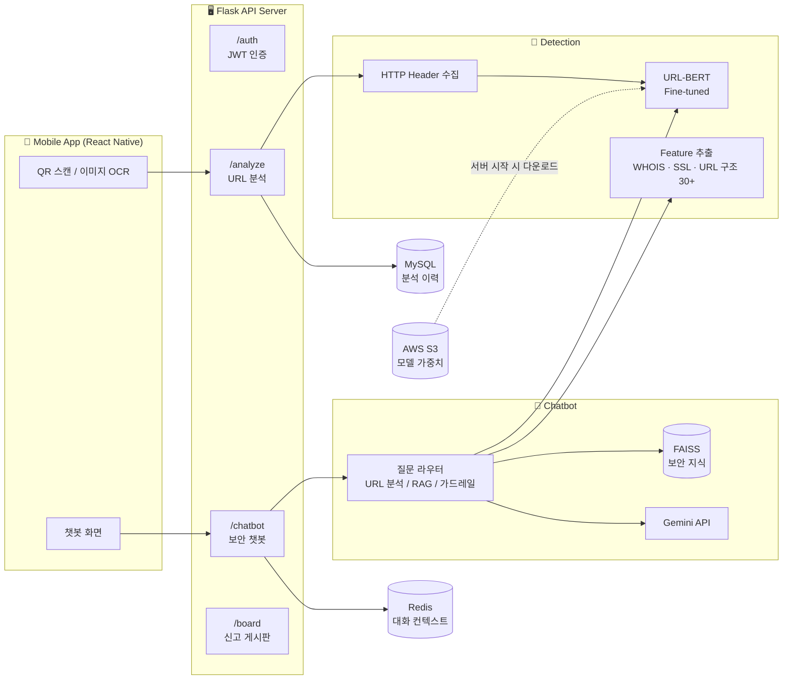
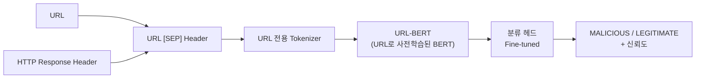

# 🔍 SQanaR — URL-BERT 기반 큐싱(QR 피싱) 탐지 서비스

> QR 코드 속 URL을 AI가 실시간으로 분석해 **악성 여부를 판별**하고, 챗봇이 **왜 위험한지 설명**해 주는 보안 앱

<p>
  
  
  
  
  
  
  
  
</p>

🏆 **과학기술대학 학술제 최우수상** (2025.11)

---

## 📋 목차
1. [프로젝트 개요](#-프로젝트-개요)
2. [핵심 성과](#-핵심-성과)
3. [시스템 구성도](#-시스템-구성도)
4. [주요 기능](#-주요-기능)
5. [탐지 모델 — URL-BERT](#-탐지-모델--url-bert)
6. [보안 설계](#-보안-설계)
7. [보안 회고 — 스스로 찾은 개선 과제](#-보안-회고--스스로-찾은-개선-과제)
8. [프로젝트 구조](#-프로젝트-구조)
9. [실행 방법](#-실행-방법)

---

## 🎯 프로젝트 개요

| 항목 | 내용 |
| :--- | :--- |
| **문제** | QR 코드로 악성 URL을 유포하는 **큐싱(Quishing)** 증가. 기존 블랙리스트(DB) 기반 탐지는 새로 만들어진 **제로데이 URL**을 잡지 못하고, 사용자는 왜 위험한지 알기 어려움 |
| **해결** | URL 구조 자체를 학습한 AI 모델로 처음 보는 URL도 판별 + 판별 근거를 챗봇이 쉬운 말로 설명 |
| **기간** | 2025.03 ~ 2025.11 |
| **형태** | 팀 프로젝트 · **AI 모델 · 백엔드 담당** |

---

## 🏆 핵심 성과

| 모델 | 정확도 |
| :--- | :-: |
| XGBoost | 95.99% |
| BERT (일반) | 94.03% |
| **URL-BERT + Header (최종)** | **99.64%** (F1 99.64%) |

- 일반 BERT·XGBoost의 한계를 분석하고, URL 구조에 특화된 **URL-BERT를 도입·파인튜닝**하여 정확도를 크게 개선
- URL + HTTP Response Header **10만 건**으로 파인튜닝 (학습 기록: [urlbert](https://github.com/dlwl224/urlbert))
- 블랙리스트에 없는 **제로데이 URL 대응력** 확보

---

## 🗺️ 시스템 구성도



---

## ✨ 주요 기능

### 1. QR · 이미지 URL 추출
- QR 스캔으로 URL 추출, 이미지 속 URL은 **EasyOCR**로 인식
- OCR 오타는 IANA TLD 목록과 비교해 보정, Punycode(IDN) 도메인 정규화 ([`bot/ocr_handler.py`](jwt_change/bot/ocr_handler.py))

### 2. 실시간 악성 URL 판별
- URL로 접속해 HTTP 응답 헤더(`Server`, `Content-Type`, `Set-Cookie`, `Location`, `Date`)를 수집
- `URL [SEP] Header` 형태로 URL-BERT에 입력해 **MALICIOUS / LEGITIMATE**와 신뢰도 반환
- 분석 결과는 MySQL에 저장해 이력 조회와 재분석에 활용 ([`bot/qr_analysis.py`](jwt_change/bot/qr_analysis.py))

### 3. 판별 근거를 설명하는 보안 챗봇
사용자 질문을 3갈래로 분기합니다 ([`bot/bot_main5.py`](jwt_change/bot/bot_main5.py)).

| 질문 유형 | 처리 |
| :--- | :--- |
| URL이 포함된 질문 | URL-BERT 판별 → "왜?"라고 물으면 **30개 이상의 특징** 중 판정에 가장 큰 영향을 준 3가지를 골라 설명 |
| 보안 지식 질문 (큐싱·피싱·취약점 등) | 라우터 모델 + 임베딩 유사도 + 키워드로 판단 → **FAISS RAG**로 근거 문서 기반 답변 |
| 보안과 무관한 질문 | **가드레일** 응답으로 서비스 목적 밖 사용 차단 |

- 추출 특징 예시: 도메인 나이·만료일(WHOIS), SSL 인증서 유효기간·발급기관, 서브도메인 개수, IP 주소 포함, `@` 포함, 단축 URL, 무료 도메인 TLD, 타이포스쿼팅 의심, Punycode 사용 ([`bot/feature_extractor.py`](jwt_change/bot/feature_extractor.py))
- Redis로 세션별 대화 기록을 관리해 이전 대화를 기억

### 4. 회원 · 게스트 모드 및 신고 게시판
- 로그인 없이도 게스트 UUID로 분석 가능, 회원은 분석 이력 검색·페이징
- 의심 URL 신고 및 관리자 판정 게시판

---

## 🤖 탐지 모델 — URL-BERT



- **왜 URL-BERT인가?** 일반 BERT는 자연어 문장으로 학습되어 도메인·경로·파라미터 같은 URL 구조를 잘 이해하지 못합니다. URL 데이터로 사전학습된 URL-BERT를 가져와 피싱 분류 태스크로 파인튜닝했습니다.
- **왜 Header를 함께 넣었나?** URL 문자열은 공격자가 정상처럼 위장할 수 있지만, 서버 응답 헤더(리다이렉트 `Location`, `Set-Cookie` 등)에는 위장하기 어려운 신호가 남습니다.
- 학습된 가중치는 용량이 커서 저장소 대신 **AWS S3**에 보관하고, 서버 시작 시 내려받습니다.
- URL-BERT 원본 코드는 Apache 2.0 라이선스입니다 ([`urlbert/urlbert2/LICENSE.txt`](jwt_change/urlbert/urlbert2/LICENSE.txt)).

---

## 🔐 보안 설계

| 항목 | 구현 |
| :--- | :--- |
| **인증** | `flask-jwt-extended` 기반 JWT, `Authorization: Bearer` **헤더 방식**만 허용 (쿠키 미사용 → 모바일 앱에 맞춤) |
| **비밀번호 저장** | `werkzeug.security`로 **해시 저장**, 비밀번호 변경 시 기존 비밀번호와 동일 여부 검사 |
| **오픈 리다이렉트 방지** | 로그인 후 이동 경로를 같은 호스트로만 제한 (`_is_safe_url`) |
| **비밀값 관리** | DB 접속 정보 · Gemini API 키 · Redis 주소를 환경 변수로 분리 |
| **챗봇 가드레일** | 보안과 무관한 질문은 답변하지 않도록 차단 |

---

## 🧩 보안 회고 — 스스로 찾은 개선 과제

프로젝트를 마친 뒤 보안 관점으로 코드를 다시 검토해 찾은 개선 과제입니다.

| # | 항목 | 위험 | 개선 방안 |
| :-: | :--- | :--- | :--- |
| 1 | **SSRF** — 사용자가 보낸 URL로 서버가 직접 요청 | 내부망 주소(예: `169.254.169.254` 클라우드 메타데이터)를 넣으면 서버가 대신 접근 | 요청 전 DNS 해석 후 사설·루프백·링크로컬 IP 차단, 리다이렉트 대상도 재검증 |
| 2 | JWT 서명 키가 코드에 고정 | 소스 공개 시 토큰 위조 가능 | `JWT_SECRET_KEY`를 환경 변수로 이동 |
| 3 | 로그아웃 토큰 폐기 목록 미연결 | 로그아웃 후에도 토큰이 만료 전까지 유효 | `token_in_blocklist_loader` 등록, 목록을 Redis에 저장 |
| 4 | CORS 전체 허용(`*`) · `debug=True` | 운영 환경에서 불필요한 노출 | 허용 Origin 제한, 운영 시 디버그 모드 해제 |

---

## 📁 프로젝트 구조

```
jwt_change/
├── Server/                 # Flask API 서버
│   ├── app.py              # 앱 · JWT · CORS · 블루프린트 등록
│   ├── routes/             # auth · analyze · chatbot · board · history · scan · settings
│   ├── models/             # DAO (user · history · scan · board · urlbert)
│   └── templates/, static/ # 웹 화면
├── bot/                    # 탐지 · 챗봇 로직
│   ├── qr_analysis.py      # QR URL 분석 진입점
│   ├── ocr_handler.py      # 이미지 OCR · URL 후보 추출
│   ├── feature_extractor.py# WHOIS · SSL · URL 특징 추출 및 설명
│   ├── bot_main5.py        # 챗봇 (URL 분석 / RAG / 가드레일 분기)
│   ├── memory_redis.py     # Redis 대화 기록
│   └── tools/              # LangChain 도구 (URL-BERT · RAG · 요약)
├── urlbert/urlbert2/       # URL-BERT 모델 · 학습 · 추론 코드
├── data/rag_dataset.jsonl  # RAG 보안 지식 데이터
└── scripts/build_index.py  # FAISS 인덱스 생성
```

---

## ⚙️ 실행 방법

> 모델 가중치(S3), MySQL, Redis, Gemini API 키가 필요합니다.

**1. 환경 변수** — `jwt_change/api.env`
```env
DB_HOST=localhost
DB_PORT=3306
DB_USER=...
DB_PASSWORD=...
DB_NAME=...
GOOGLE_API_KEY=...
REDIS_URL=redis://localhost:6379/0
```

**2. 서버 실행**
```bash
cd jwt_change
pip install flask flask-cors flask-jwt-extended pyjwt pymysql redis python-dotenv requests \
            torch transformers pytorch-pretrained-bert scikit-learn joblib pandas numpy \
            langchain langchain-community langchain-google-genai faiss-cpu sentence-transformers \
            easyocr pillow python-whois dnspython idna beautifulsoup4 boto3
python -m Server.app
```
➡️ 실행한 컴퓨터의 브라우저에서 `localhost:5000` 로 접속합니다. (배포된 공개 주소가 아니라, 직접 실행했을 때만 열리는 로컬 주소입니다)

---

## 👩‍💻 담당 역할

- **AI 모델** — URL-BERT 구현 · 파인튜닝, URL+Header 입력 설계, 30개 이상 특징 추출 파이프라인
- **백엔드** — Flask REST API, MySQL 스키마 설계, 분석 결과 저장 · 조회 파이프라인
- **챗봇** — LangChain 기반 질문 분기, FAISS 보안 지식 인덱스, Redis 대화 기록, Gemini 연동
